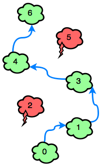

# Jumping on the Clouds
[link to chalange](https://www.hackerrank.com/challenges/jumping-on-the-clouds/problem?isFullScreen=true&h_l=interview&playlist_slugs%5B%5D=interview-preparation-kit&playlist_slugs%5B%5D=warmup)

There is a new mobile game that starts with consecutively numbered clouds. Some of the clouds are thunderheads and others are cumulus. The player can jump on any cumulus cloud having a number that is equal to the number of the current cloud plus **1** or **2**. The player must avoid the thunderheads. Determine the minimum number of jumps it will take to jump from the starting postion to the last cloud. It is always possible to win the game.

For each game, you will get an array of clouds numbered **0** if they are safe or **1** if they must be avoided.

## Example
    c = [0,1,0,0,0,1,0]

Index the array from **0...6**. The number on each cloud is its index in the list so the player must avoid the clouds at indices **1** and **5**. They could follow these two paths: $0\rightarrow 2\rightarrow 4\rightarrow 6$ or $0\rightarrow 2\rightarrow 3\rightarrow 4\rightarrow 6$. The first path takes **3** jumps while the second takes **4** . Return **3**.

## Function Description
Complete the jumpingOnClouds function in the editor below.

jumpingOnClouds has the following parameter(s):
*   int c[n]: an array of binary integers

## Input Format
The first line contains an integer ***n*** , the total number of clouds. The second line contains ***n*** space-separated ***c***[***i***] binary integers describing clouds  where $0\leq i\leq n$.

## Constraints
* $2\leq n\leq 100$
* $c[i]\in$  {0, 1}
* $c[0]= c[n-1]= 0$

## Output Format
Print the minimum number of jumps needed to win the game.

## Sample Input 0
    7
    0 0 1 0 0 1 0

## Explanation 0:
The player must avoid c[2] and c[5]. The game can be won with a minimum of 4 jumps:




## Sample Input 1
    6
    0 0 0 0 1 0

## Sample Output 1
    3

## Explanation 1:
The only thundercloud to avoid is **c[4]** . The game can be won in **3** jumps:<br>


## Solution

[UML](Assets/Jumping%20on%20the%20Clouds.pdf)

``` java script
 let result = 0;
    let currentCloud = 0 ;
    const final = c.length-1;
        do{  
            if (c[currentCloud + 2] === 0 ) {
                currentCloud += 2;
            } else {
                currentCloud += 1;
            }
            result += 1;
        } while (currentCloud < final);
        
    return result
```


